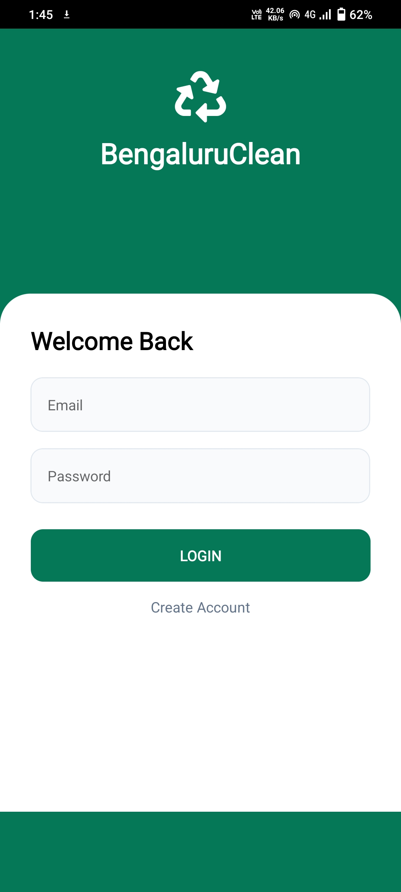
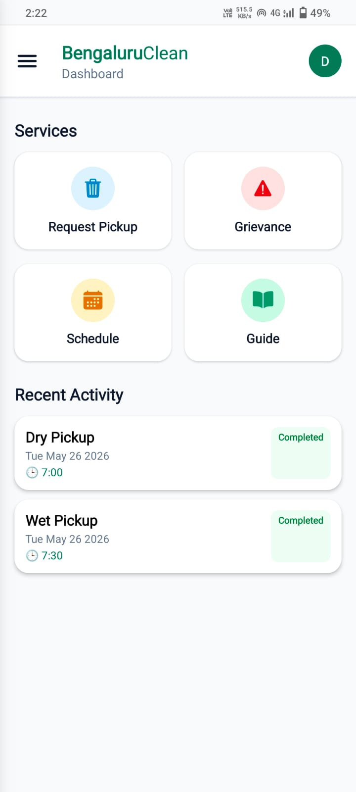
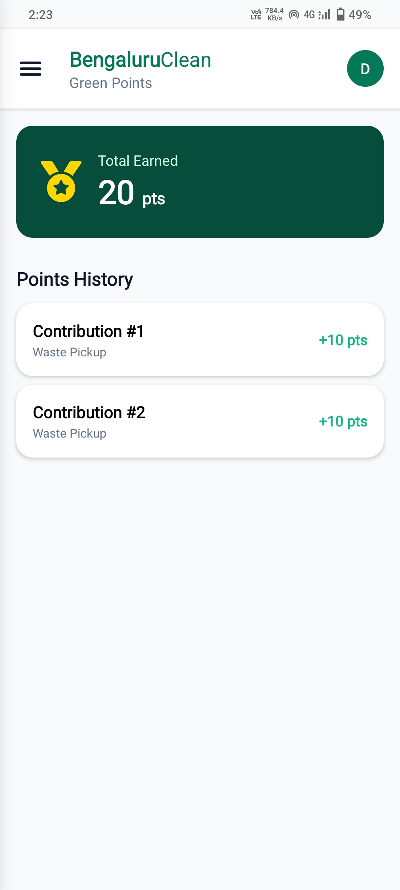
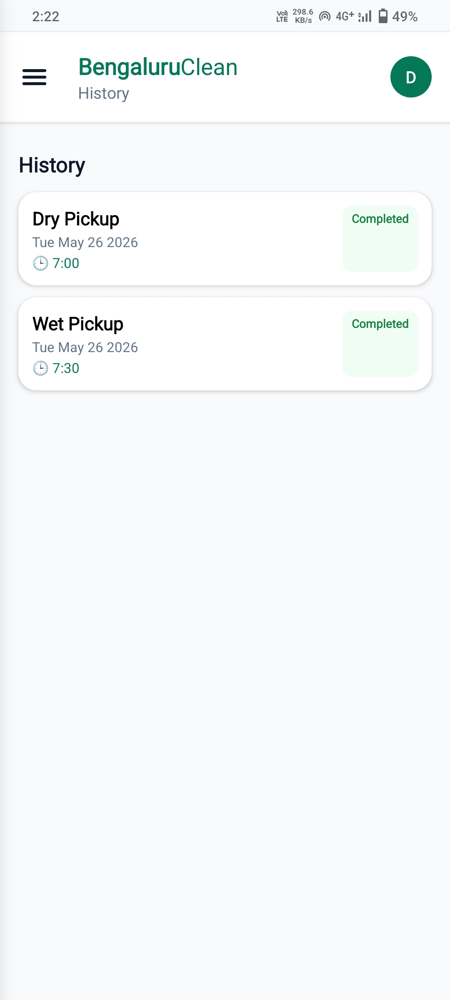
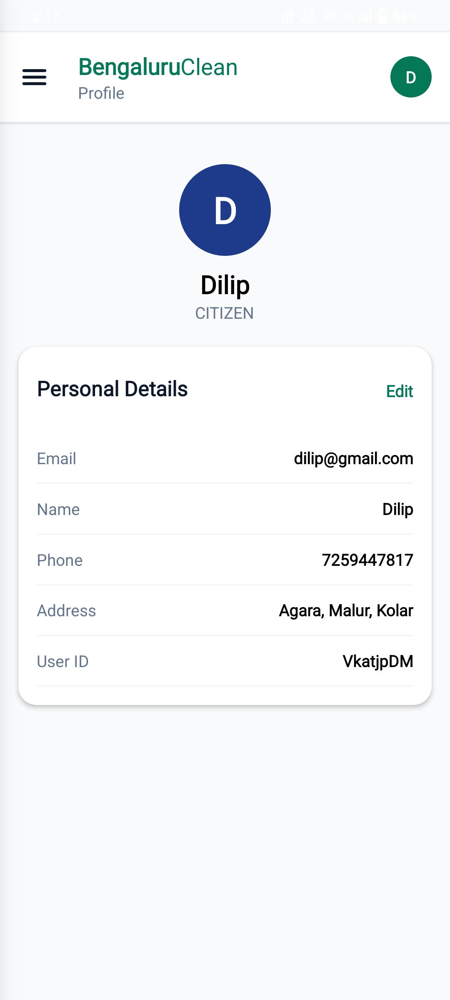
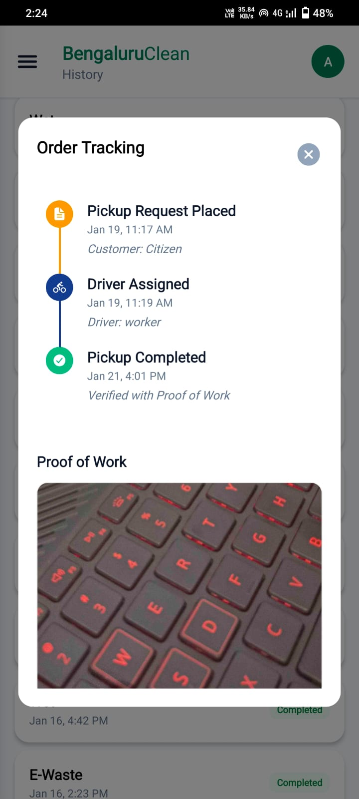
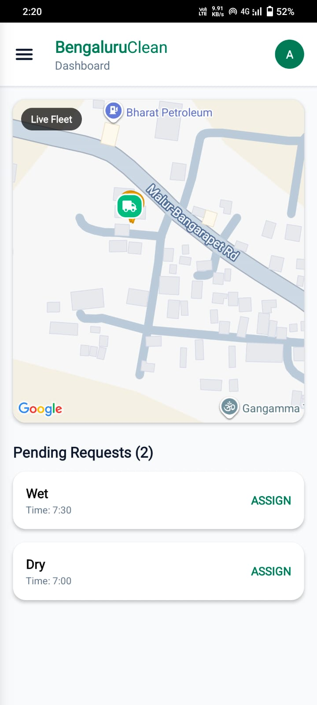
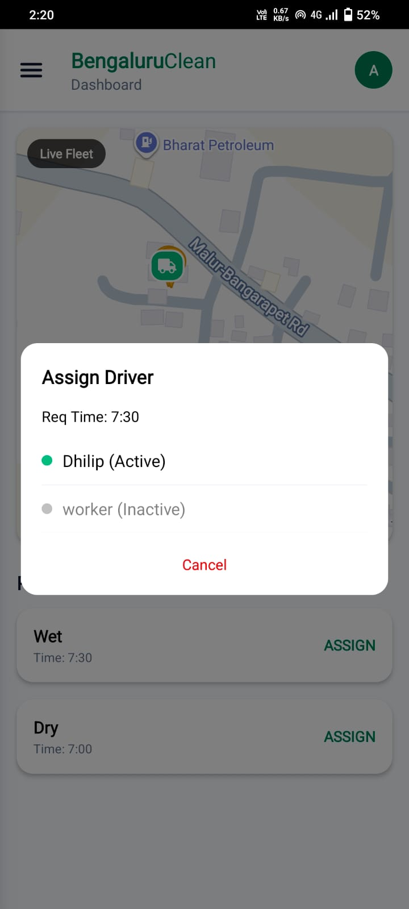

# ♻️ Bengaluru Clean

  

  A smart waste management and real-time tracking mobile application built using React Native and Firebase.

---

# 📌 About The Project

Bengaluru Clean is an end-to-end waste management solution designed to optimize urban sanitation in Bengaluru. The platform connects citizens, field workers, and municipal authorities through a modern, intuitive interface to streamline the waste collection process and promote environmental accountability.

The application provides:
- Automated waste pickup scheduling
- Real-time worker location tracking
- Gamified environmental contributions (Green Points)
- Centralized administrative oversight
- Efficient fleet and driver management

---

# 🚀 Features

## 🏠 Citizen Dashboard
- Request waste pickups for Dry, Wet, and E-Waste
- Track impact via Green Points
- View historical pickup logs
- User-friendly profile management

---

## 🚚 Field Worker Module
- Real-time GPS location tracking
- Duty status toggle (On-Duty/Offline)
- Task management and completion verification

---

## 🏢 Admin Dashboard
- Live map fleet monitoring
- Manual driver-to-task assignment
- Operational analytics and insights

---

# 🛠️ Tech Stack

## Frontend
- React Native
- Expo

## Backend & Database
- Firebase Authentication
- Firebase Firestore

## Programming Language
- JavaScript

## Maps & Location
- react-native-maps
- Expo Location & Image Picker

---

# 📂 Project Structure

~~~bash
BengaluruClean/
│
├── assets/
│   ├── screenshots/
│   │   ├── AdminDashboard.jpg
│   │   ├── AssignDriver.jpg
│   │   ├── ClientDashboard.jpg
│   │   ├── GreenPoints.jpg
│   │   ├── History.jpg
│   │   ├── LoginPage.jpg
│   │   ├── Profile.jpg
│   │   ├── Schedule Pickup.jpg
│   │   └── Tracking.jpg
│
├── App.js
├── app.json
├── package.json
└── README.md
~~~

---

# 📸 Screenshots

## 🔐 Login Page

  

---

## 🏠 Client Dashboard

  

---

## 📅 Schedule Pickup

  

---

## 🍃 Green Points

  

---

## 📜 History

  

---

## 👤 Profile

  

---

## 🚚 Real-time Tracking

  

---

## 🏢 Admin Dashboard

  

---

## 🎯 Assign Driver

  

---

# ⚙️ Installation

## Clone Repository

~~~bash
git clone [your-repository-link]
~~~

---

## Navigate To Project Folder

~~~bash
cd BengaluruClean
~~~

---

## Install Dependencies

~~~bash
npm install
~~~

---

## Start Expo Server

~~~bash
npx expo start
~~~

---

# 🔥 Firebase Configuration

Create a Firebase project and enable:

- Firebase Authentication
- Cloud Firestore Database

Add your project-specific Firebase credentials in the application configuration file.

---

# 🎯 Project Objectives

- Optimize waste collection logistics
- Enhance urban sanitation in Bengaluru
- Increase citizen engagement in sustainability
- Provide data-driven insights for city waste management

---

# 📄 License

This project is developed for the Bengaluru Clean initiative. All rights reserved.
